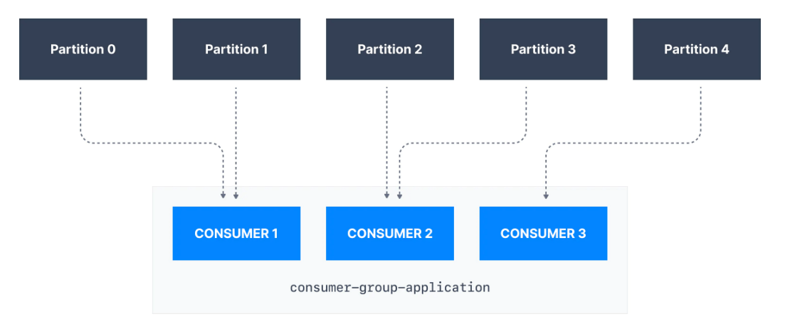

# APACHE KAFKA SERIES - KAFKA FOR BEGINNERS
## KAFKA INTRODUCTION
## 1. Apache Kafka 
* İlk olarak data entegrasyonuna ait şirketlerin zorluklarını ele alalım. Bu şirketlerin kullandıkları bir kaynak sistemi,(örneğin bir veri tabanı) olacaktır. Şirketin başka bir bölümü bu verileri alıp başka bir sisteme yerleştirmek isteyecektir.(Örneğin, bir hedef(target) sistem).Dolayısıyla verilerin bir kaynak sistemden bir hedef sisteme taşınması gerekir. Bu ilk başta çok basittir. Bazı kodlar yazan ve ardından dataları alan, ayıklayan, transform eden ve sonra upload eden birisini düşünün. 

<p align="center">
  
</p>

* Bir süre sonra, şirketiniz gelişiyor. Birçok kaynak sisteme ve aynı zamanda birçok hedef sisteme sahip oluyor. Şimdi veri entegrasyonu zorluklarınız çok daha karmaşık hale geldi çünkü tüm kaynak sistemleriniz bilgi paylaşmak için tüm hedef sistemlerinize veri gönderiyor. Aşağıda gördüğümüz gibi, çok fazla entegrasyona sahip olduk.

<p align="center">
  
</p>

* Önceki mimariye göre, örneğin 4 kaynak sisteminiz ve 6 hedef sisteminiz varsa, bunun çalışması için 24 entegrasyon oluşturmanız gerekecektir. Ve her entegrasyon, teknoloji değiştiği için protokolle ilgili zorlukları da beraberinde getiriyor. Yani veriler, veri formatı olarak TCP, HTTP, REST, FTP, JDBC üzerinden taşınıyor olabilir.  Peki veriler nasıl ayrıştırılıyor? Binary, CSV, JSON, Avro, Protobuf... Data schema(şema) ve evulation(evrim).. Veriler kaynak veya hedef sistemlerinizde genel olarak şekil değiştirirse ne olur? 
* Ayrıca her bir kaynak sistem, tüm bağlantılardan ve verileri ayıklama talebinden dolayı **artan bir yüke** sahip olacaktır.
* Peki bu sorunu nasıl çözeceğiz? **Apache Kafka** kullanarak biraz ayrıştırma getiriyoruz. 
* Yani hala kaynak sistemlerimiz ve hedef sistemlerimiz var fakat bu sefer mimarimizin tam ortasına **Apache Kafka** koyacağız. Bu durumda neler olacak?
* Kafka aslında veri almak ve göndermek içindir. Apache Kafka'ya veri üretmek için **producing** adı verilir. Artık kaynak sistemler veri göndermekten sorumludur. Tüm verileriniz bir veri akışına sahip olacak ve hedef sistemleriniz, kaynak sistemlerinizden veri almaları gerekirse, aslında Apache Kafka'nın verilerinden yararlanacaklardır. Böylece hedef sistemleriniz artık Apache Kafka'dan bilgileri alıyor olacak ve bu sayede ölçeklenebilir olacaktır.

<p align="center">
  
</p> 

* Bu mimariyi değerlendirecek olursak, kaynak sistemleriniz neler olabilir?
  - Web site günlükleri, fiyatlandırma verileri, finansal işlemler veya kullanıcı etkileşimleri olabilir. 
* Verilen bu örneklerin hepsi veri akışı üretir. Bu veriler gerçek zamanlı olarak oluşturulur ve Apache Kafka'ya gönderilir. 
* Hedef sistemlere örnek verecek olursak:
  - Veritabanları, analiz sistemleri, e-posta sistemleri ve denetleme sistemleri olabilir. 

### 1.2 Neden Apache Kafka Kullanmalıyım?
* Kafka LinkedIn tarafından, open source olarak Java ile geliştirilmiştir. Günümüzde Confluent, IBM, Cloudera, LinkedIn, Twitter ve benzeri büyük şirketler tarafından kullanılmaktadır. 
* Dağıtık ve esnek bir mimariye sahiptir. Kafka maintenance sistemler kapatılmadan yapılabilir. 
* Horizontal scalability özelliğine sahiptir. 
  - Bu Kafka clusterinize zaman içinde **broker** ekleyebileceğiniz anlamına gelir. Yüzlerce broker ile ölçeklendirebilirsiniz. 
* **Broker:** Kafka sistemlerinin en temel bileşenidir, Kafka clusterinde çalışan her bir sunucu/servise broker denir. Broker'lar fiziksel olarak kurulu oldukları sunucuya bağlıdırlar ama bir broker kendi üstünde olmasa bile kümede ki tüm topic ve partition'lardan haberdardır
  - Mesaj çıktıları için büyük bir ölçeğe sahiptir. Böylece saniyede milyonlarca mesaj alabilirsiniz. Örneğin: Twitter..
* Yüksek performansa sahiptir. 10 milisaniyeden daha kısa bir sürede ölçeklenebilirdir. 
* Apache Kafka'yı 2000 den fazla firma kullanmaktadır. En güzel yanı ise Apache Kafka'yı kullanabilmek için mega bir şirket olmanıza gerek yok :)

### 1.3 Apache Kafka Kullanım Alanları
* Messaging System
* Activity Tracking 
* Birçok farklı konumdan metric ve uygulama günlüklerini toplamak
* Stream Processing(Streams API)
* Sistem bağımlılıklarını ve mikro hizmetleri birbirinden ayırmak
* Spark, Flink, Storm, Hadoop gibi büyük veri teknolojileri ile entegrasyona sahiptir. 
* Mikro-services pub/sub
### 1.4 Kullanım Örnekleri
* Netflix, siz tv programlarını izlerken gerçek zamanlı olarak öneriler uygulamak için kafka kullanır.
* Uber, kullanıcıların taksi ve yolculuk verilerini gerçek zamanlı olarak toplamak, talebi hesaplamak, tahmin etmek ve fiyatlandırma sunmak için kafkayı kullanır. 
* LinkedIn ise spam'i önlemek, kullanıcı etkileşimlerini toplamak ve gerçek zamanlı olarak daha iyi bağlantı önerileri yapmak için Kafka'yı kullanıyor.  


# Kafka Theory 
## 1. Kafka Topics
* **Topics:** Kafka clusterinizdeki belirli bir veri akışıdır. Kafka topicleri ilgili olayları organize eder. Örneğin, bir uygulamadan gelen günlükleri içeren logs adında bir topic olabilir. Topicler kabaca SQL tablolarına benzer. Ancak, SQL tablolarının aksine, Kafka topicleri sorgulanamaz. Bunun yerine, verileri kullanmak için Kafka producer ve consumer oluşturmalıyız. Topiclerdeki veriler binary formatta anahtar-değer formunda saklanır.

<p align="center">
  
</p> 

* Veritabanlarının veri kümelerini düzenlemek ve bölümlere ayırmak için tablolara sahip olmasına benzer şekilde, Kafka ilgili mesajları düzenlemek için **topic** kavramını kullanır.
* Bir topic, adı ile tanımlanır. Örneğin, uygulamamızdan günlük mesajları bulunduran logs adında bir topiğimiz ve uygulamamızdan satın alma verilerini olduğu gibi içeren purchases adında başka bir topiğimiz olabilir.
* Kafka topicleri herhangi bir formatta(text, JSON vb.) her türlü mesajı içerebilir ve tüm bu mesajların dizisine **data stream** denir.
* Kafka topiclerindeki veriler varsayılan olarak bir hafta sonra silinir (the default message retention period olarak da adlandırılır) ve bu değer yapılandırılabilir. Bu eski verileri silme mekanizması, bir Kafka kümesinin zaman içinde topicleri geri dönüştürerek disk alanının tükenmemesini sağlar.
* Topicler SQL tablolarına benzer fakat bunları sorgulayamıyoruz demiştik. Kafka topiclerine veri eklemek için **Kafka Producer**, topicteki verileri okumak için ise **Kafka Consumer** kullanacağız. Kafkada sorgulama özelliği yoktur.

<p align="center">
  
</p> 

### 1.1 Kafka Topic Example
* Bir trafik şirketi, kamyon filosunu takip etmek istiyor. Bunun için her kamyon, konumunu Kafka'ya bildiren bir GPS bulucu ile donatılmıştır. Kamyonların konumlarını yayınladıkları - truck_gps adında bir topic oluşturabiliriz. Her kamyon Kafka'ya her 20 saniyede bir mesaj gönderebilir ve gönderilen her mesaj kamyon kimliğini ve kamyon konumunu (enlem ve boylam) içerecektir. Topic uygun sayıda partitiona ayrılabilir (örneğin 10). Topic'in farklı consumerları olabilir. Örneğin, bir panoda kamyon konumlarını görüntüleyen bir uygulama veya önemli bir olay meydana geldiğinde bildirim gönderen başka bir uygulama gibi.

<p align="center">
  
</p> 

## 2. Partitions and Offsets
* Topicleri, **partitions** a ayırabiliriz. (Örneğin: 100 partitions) Yani bir topic 100 partitionstan oluşabilir. 
* Bir topic'in partition sayısı, topic oluşturulurken belirlenir. Partitionlar 0'dan N-1 e kadar numaralandırılır ve burada N değeri toplam partition sayıdır. 
* Kafka topicleri immutable yani değişmezdir. Veriler bir partitiona yazıldıktan sonra değiştirilemez, silinemez ve güncellenemez. 

<p align="center">
  
</p> 

* Yukarıdaki örnekte üç partitionlu bir kafka topicim var. Partition 0, Partition 1, Partition 2 
* Kafka topicine gönderilen mesajlar bu partitionlara dağılacak ve her partitiondaki mesajlar sıralanacak. Yani ilk mesajım 0 bölümüne, sonra 1,2..9 şeklinde kimliğe sahip olacak. Sonrasında partitiona mesaj yazmaya devam ederken bu sayı artacak. Kısaca her birinin sonuna iletilerin eklendiği üç partition'lı bir topic'i göstermektedir.
* Her partition için veri yazdığımda bu aynı durum gerçekleşecek ve id(sayı, kimlik) artmaya devam edecek. Böylece bu partitionlardaki mesajlar yazıldıkları yerde kendilerine has bir kimlik almış olacaktır. Bu id ler 0 dan başlayacak şekilde artarak gitmektedir. Ve bu numaralara-id lere **Kafka Offsets** denir. 
* Offset, Kafka'nın bir partition'a yazılırken her iletiye eklediği bir tamsayı değeridir. Belirli bir partitiondaki her mesajın benzersiz bir offset numarası vardır.
* Offset kavramını özetleyecek olursak; **Apache Kafka Offset**, bir mesajın bir Kafka partition içindeki konumunu temsil eder. Her partition için offset numaralandırma 0'dan başlar ve belirli bir Kafka partition gönderilen her mesaj için artırılır. Bu, Kafka offsetlerinin yalnızca belirli bir parititon için bir anlamı olduğu anlamına gelir. Örneğin, partition 0'daki offset 3, partition 1'deki offset 3 ile aynı verileri temsil etmez.
  - Bir topic'in birden fazla partition'ı varsa, Kafka bir partition içindeki mesajların sırasını garanti eder, ancak partitionlar arasında mesajların sıralaması yoktur.
  - Kafka topiclerindeki mesajların zamanla silindiğini (yukarıda görüldüğü gibi) bilsek de offsetler asla tekrar kullanılmaz. Hiç bitmeyen bir sırayla sürekli olarak artırılırlar.

### 2.1 Topics, partitions and offsets - Important Notes
* Bir veri, bir partitiona yazıldığında o veri değiştirilemez. (immutability)
* Kafkadaki mesajlar yalnızca sınırlı bir süre için tutulur. (default bir hafta - değiştirilebilir) Bir hafta sonra verileriniz kaybolacaktır. 
* Offsetin yalnızca belirli bir partition için anlamı vardır. 
  - Yukarıdaki 'Topic Partition' görselinden örnek verecek olursak --> 0. partitondaki 3. offset, 1. bölümdeki 3. offset ile aynı veriyi temsil etmemektedir.
  - Önceki mesajlar silinmiş olsa bile offset yeniden kullanılmaz.
* Sıralama yalnızca bir partition içinde garanti edilir (Partition arasında değil) Bunun anlamı, her partitiondaki mesajların artan bir offseti vardır. Bu da mesajların sıralı oldukları anlamına gelir. Ve bu mesajları offset sıralarına göre okuruz. Fakat partitionlar arasında sıralamanın garantisi verilmez. 
* Bir anahtar sağlanmadığı sürece veriler bir partitiona rastgele atanır (bu konuda daha sonra daha fazla bilgi verilecektir)
* Bir kafka topicinde istediğiniz kadar partition oluşturabilirsiniz. 

## 3. Producers

* Kafka ile bir topic oluşturulduktan sonra sıradaki adım topic'e veri göndermektir. **Kafka producerların** devreye girdiği yer burasıdır.
* Topiclere veri gönderen uygulamalar, Kafka producerlar olarak bilinir.
* Uygulamalar, Apache Kafka'ya yazmak için genellikle bir Kafka client library entegre ederler.
* Python, Java, Go ve diğerleri dahil olmak üzere günümüzde popüler olan hemen hemen tüm programlama dilleri için mükemmel client libraryler mevcuttur.

<p align="center">
  
</p> 

* Producera gelen yük, partition sayısı sayesinde birçok broker arasında dengelenir.
* Bir Kafka producer, bir topic'e mesaj gönderir ve mesajlar, **key hashing** gibi bir mekanizmaya göre partitionlara dağıtılır.
* Bir mesajın bir Kafka topic'e başarılı bir şekilde yazılabilmesi için, bir producer'ın bir onay düzeyi (acks) belirtmesi gerekir. Bu konu, topic replication bölümünde derinlemesine anlatılacaktır.

### 3.1 Message Key
* Her event mesajı opsiyonel olarak bir key ve bir value çifti içerir.
* Key'in producer tarafından belirtilmemesi durumunda (key=null), mesajlar bir topic içindeki partitionlar arasında eşit olarak dağıtılır. Bu, mesajların sırayla gönderildiği anlamına gelir (partition p0, sonra p1, sonra p2, vb... sonra tekrar p0'a vb.)
* Bir key gönderilirse (key != null), aynı key'i paylaşan tüm mesajlar her zaman aynı Kafka partition'a gönderilir ve saklanır. Key, bir mesajı tanımlayan herhangi bir şey olabilir (bir dizi, sayısal değer, binary değer, vb.)
* Kafka mesaj keyleri, aynı partition'ı paylaşan tüm mesajlar için mesaj sıralamasına ihtiyaç duyulduğunda yaygın olarak kullanılır. Örneğin, bir filodaki kamyonları izleme senaryosunda, kamyonlardan gelen verilerin her bir kamyon düzeyinde sıralı olmasını istiyoruz. Bu durumda key'i truck_id olarak seçebiliriz. Aşağıda gösterilen örnekte, truck_id_123 kimliğine sahip kamyondan gelen veriler her zaman p0 bölümüne gidecektir.

<p align="center">
  
</p> 

* Birkaç başlık sonra key hashleme sürecini (hangi anahtarın hangi bölüme gideceğini belirleme süreci) anlatacağım. 

### 3.2 Kafka Messages Anatomy
* Kafka mesajları producer tarafından oluşturulur. Bir Kafka mesajı aşağıdaki unsurlardan oluşur:

<p align="center">
  
</p> 

* **Key:** Kafka mesajında ​​isteğe bağlıdır ve boş olabilir. Key bir dizi, sayı veya herhangi bir nesne olabilir ve ardından key binary formata serialize edilir.
* **Value:** Mesajın içeriğini temsil eder ve boş da olabilir. Değer formatı isteğe bağlıdır ve daha sonra binary formata serialize edilir.
* **Compression Type:** Kafka mesajları sıkıştırılabilir. Sıkıştırma türü, mesajın bir parçası olarak belirtilebilir. Seçenekler none, gzip, lz4, snappy ve zstd'dir.
* **Headers:** Key-value çiftleri biçiminde isteğe bağlı Kafka mesaj başlıklarının bir listesi olabilir. Özellikle tracking  için, mesajla ilgili meta verileri belirtmek üzere başlıklar eklemek yaygın bir uygulamadır.
* **Partition + Ofset:** Bir mesaj bir Kafka topic'e gönderildiğinde, bir partition numarası ve bir offset kimliği alır. Topic+partition+offset kombinasyonu, mesajı benzersiz bir şekilde tanımlar.
* **Timestamp:** Mesaja kullanıcı veya sistem tarafından bir zaman damgası eklenebilir.

### 3.3 Kafka Message Serializer
* Kafka yalnızca baytları producerlardan girdi olarak kabul eder ve baytları consumerlara çıktı olarak gönderir.
* Kafkayı güzel kılan şeylerden biriside yalnızca bayt dizisini kabul etmesidir. 
* Fakat mesajları oluşturduğumuzda bunlar bayt olarak oluşturulmaz. Bu sebeple 'Message Serializer' işlemini yapmamız gerekir.
* Birçok programlama dilinde, key ve  value, kodun okunabilirliğini büyük ölçüde artıran nesneler olarak temsil edilir. Ancak Kafka brokers (sunucular), mesajların key-value çiftlerini byte array olarak bekler. Producer'ın, bu nesneleri binary'e dönüştürmesine **serialization** adı verilir.
* Aşağıda gösterildiği gibi, bir integer key ve bir string value olan bir mesajımız var. Key bir integer olduğundan, onu bir byte array'e dönüştürmek için bir IntegerSerializer kullanmamız gerekir. Value için ise, bir string olduğundan StringSerializer'dan yararlanmalıyız.

<p align="center">
  
</p> 

* Apache Kafka için Java cliend SDK'sının bir parçası olarak, string (JSON'un yerini alır), integer, float gibi birkaç serializer zaten mevcuttur. Diğer serializerların kullanıcılar tarafından yazılması gerekebilir. Ancak yaygın olarak dağıtılan Kafka serializer da mevcuttur ve Confluent Schema Registry sayesinde JSON-Schema, Apache Avro ve Protobuf gibi formatlar için verimli bir şekilde yazılabilir.

### 3.4 Kafka Message Key Hashing
* **Kafka partitioner**, bir kayıt alan ve o kaydın hangi partition'a gönderileceğini belirleyen bir code logictir.

<p align="center">
  
</p> 

* Bu anlamda, partition bir mesajı belirli bir topic partition'a yönlendirmek için mesaj key hashing kullanır. Bir hatırlatma olarak, aynı key'e sahip tüm mesajlar aynı bölüme gidecektir.
> Key Hashing, bir key'in bir partition'a eşlenmesini belirleme işlemidir.
* Varsayılan Kafka partitioner, meraklılar için aşağıdaki formülle **murmur2 algoritması** kullanılarak keyleri hashler:
```
targetPartition = Math.abs(Utils.murmur2(keyBytes)) % (numPartitions - 1)
```
* Producer sınıfı olan partitioner.class ile varsayılan partitioner'ı override etmek mümkündür, ancak ne yaptığınızı bilmiyorsanız tavsiye edilmez.

## 4. Consumers

* Kafka topiclerimize nasıl veri yazılacağını gördük ama şimdi topiclerdeki verileri okumamız gerekiyor. Bunun için **Consumer**ları kullanacağız. 
* Kafka topiclerinden veri okuyan uygulamalar consumer olarak bilinir. Uygulamalar, Apache Kafka'dan veri okumak için bir Kafka client library entegre eder. Python, Java, Go ve diğerleri dahil olmak üzere günümüzde popüler olan hemen hemen tüm programlama dilleri için mükemmel client libraryler mevcuttur.
* Consumerlar, Apache Kafka'da aynı anda bir veya daha fazla partitiondan okuyabilir ve veriler aşağıda gösterildiği gibi her partitiondaki sırayla okunur.

<p align="center">
  
</p> 

* Bir consumer, verileri her zaman daha düşük bir offsetten daha yüksek bir offsete okur ve verileri geriye doğru okuyamaz.
* Consumer birden fazla partitiondan veri okuyorsa, aynı anda kullanıldıkları için birden çok partitionda mesaj sırası garanti edilmez, ancak mesajın okunma sırası her bir partition içinde yine de garanti edilir.
* Varsayılan olarak, Kafka consumerlar yalnızca Kafka'ya ilk kez bağlandıktan sonra üretilen verileri okurlar. Bu, Kafka'da tarihsel verileri okumak için, komutun girdisi olarak belirtilmesi gerektiği anlamına gelir.
* Kafka consumerların bir "pull model" uyguladıkları da bilinmektedir. Bu, Kafka brokerlarn consumerlara sürekli olarak veri göndermesi yerine, Kafka consumerların veri okumak için Kafka brokerlarından veri talep etmesi gerektiği anlamına gelir. Bu uygulama, consumerların topiclerin okunma hızını kontrol edebilmeleri için yapılmıştır.
* Pull model için yukarıdaki görseli inceleyecek olursak; Veri içeren üç adet partitionumuz var. Consumerlardan birisi Topic-A isimli topic'in partition 0 dan verileri okuyor ve başka bir consumer, partition 1 ve partition 2 den veri okuyor. Buradan şu sonucu çıkarabiliriz:
  - Consumer hangi brokerdan okuma yapacağını otomatik olarak bilmektedir. (Kendi load balance'ini yapma yetkisine sahiptir.)

### 4.1 Consumer Deserializer
* Daha önce de gördüğümüz gibi Kafka producerlar tarafından gönderilen veriler önce serialize edilmekteydi. Bu sefer, Kafka consumerlar tarafından alınan verilerin uygulamanızda kullanılabilmesi için doğru şekilde **deserializer** edilmesi gerekir.
  - Producer bir String'i *StringSerializer* kullanarak serialize ettiyse, consumer'ın *StringDeserializer* kullanması gerekir.
  - Producer bir Integer'i *IntegerSerializer* kullanarak serialize ettiyse, consumer'ın *IntegerDeserializer* kullanması gerekir.

<p align="center">
  
</p> 

* Bir topic'in serialize ve deserialize formatı, topic yaşam döngüsü boyunca değişmemelidir. Bir topic veri biçimini (örneğin JSON'dan Avro'ya) değiştirmeyi düşünüyorsanız, yeni bir topic oluşturmak ve bu yeni topic'ten yararlanmak için uygulamalarınızı taşımak en iyi uygulama olarak kabul edilir.
> Kafka topic'e gönderilen ve üzerinde anlaşmaya varılan serialize formatına uymayan mesajlara **poison pill** denir.
* Doğru şekilde deserialize edilememesi; uygulamalarda flowun bozulmasına veya tutarsız verilere neden olabilir. Bu hataları ayıklamak zordur. Bu yüzden kodunuzu ilk kez yazarken bunu düşünmek en iyisidir.

## 5. Kafka Consumer Groups and Offset
* Consumerların, Kafka topic partitionlarındaki verileri bireysel olarak consume ettiklerini gördük, ancak yatay ölçeklenebilirlik amacıyla Kafka topiclerinin grup olarak kullanılması önerilir.
  > Yatay ölçekleme, kaynak havuzuna daha fazla makine, dikey ölçekleme ise mevcut bir makineye daha fazla güç (örn. işlemci, bellek ve benzeri) ekleyerek gerçekleştirilir.

### 5.1 Consumer Groups
* Aynı uygulamanın parçası olan ve dolayısıyla aynı "mantıksal işi (logical job)" yapan consumerlar, bir Kafka consumer grubu olarak gruplandırılabilir.
* Bir topic genellikle birçok partitiondan oluşur. Bu partitionlar, Kafka consumerlar için bir paralellik birimidir.
* Bir Kafka consumer grubunu kullanmanın faydası, grup içindeki consumerların okuma işini farklı partitionlardan okuyacak şekilde koordine olacak olmasıdır.

<p align="center">
  
</p> 

### 5.2 Consumer Group ID
* Kafka consumerlara aynı belirli grubun parçası olduklarını belirtmek için, consumer tarafında **group.id** ayarını belirtmeliyiz.
* Kafka consumerlar, consumerları bir partitiona atamak ve yük dengelemenin aynı gruptaki tüm consumerlar arasında gerçekleştirilmesini sağlamak için otomatik olarak bir **GroupCoordinator** ve bir **ConsumerCoordinator** kullanır.
> Her topic partition'ın, consumer grubu içindeki yalnızca bir consumera atandığını, ancak consumer grubundaki bir consumera birden çok partition atanabileceğini unutmayınız.
* Yukarıdaki örnekte, consumer-group-application-1 consumer grubunun Consumer 1'ine Partition 0 ve Partition 1 atanırken, Consumer 2'ye Partition 2 ve Partition 3 atanır ve son olarak Consumer 3'e Partition 4 atanır. Bu sebeple Consumer 1 Partition 0 ve Partition 1'den, Consumer 2, Partition 2 ve Partition 3'ten ve Consumer 3, Partition 4'ten mesajlar alır.
* Kafka topiclerini okuyan uygulamalarınızın (consumer grupları) her biri (birçok consumerdan oluşabilir) farklı bir group.id belirtmelidir. Bu, birden fazla uygulamanın (consumer grubunun) aynı topicten aynı anda consume edebileceği anlamına gelir:

<p align="center">
  
</p> 

* Bir topic'in, partition sayısından daha fazla consumer varsa, bazı consumerlar aşağıda gösterildiği gibi pasif kalacaktır. Genellikle, bir consumer grubunda partition sayısı kadar consumer olur. Daha yüksek verim için daha fazla consumer istiyorsak, topic'i oluştururken daha fazla partition oluşturmalıyız. Aksi takdirde consumerların bir kısmı atıl kalabilir.

<p align="center">
  
</p> 

### 5.3 Consumer Offset
* Kafka brokerlar, belirli bir consumer grubunun en son hangi iletileri başarıyla işlediğini takip eden **__consumer_offsets** adlı internal bir topic kullanır.
* Bildiğimiz gibi, bir Kafka topic'teki her mesajın bir partition ID ve bir offset ID'si vardır.
* Bu nedenle, bir consumer'ın bir topic partition'ının ne kadarını okuduğunu gösteren "checkpoint" değerini güncellemek için, consumer düzenli olarak en son işlenen mesajı commitler. Bu aynı zamanda **consumer offset** olarak da bilinir.
* Aşağıdaki şekilde, consumer grubundan bir consumer, offset 4262'ye kadar mesajları consume etmiştir. Bu nedenle consumer offseti 4262 olarak ayarlanmıştır.

<p align="center">
  
</p> 

* Client libraylerin çoğu sizin için periyodik olarak otomatik olarak Kafka'ya commitler atar ve sorumlu Kafka broker __consumer_offsets topic'e yazmayı sağlar. Bu nedenle consumerlar bu topic'e doğrudan yazamazlar.
* Commit işlemi, consume edilen her mesaj için yapılmaz (çünkü bu verimsiz olur) ve bunun yerine periyodik olarak yapılır.
* Belirli bir offsetin commitlenmesi, daha düşük bir offsete sahip önceki tüm mesajların da işlenmiş olarak kabul edildiği anlamına gelir.

#### 5.3.1 Consumer Offsetleri Neden Kullanmalıyız??
* Offsetler birçok uygulama için kritik öneme sahiptir. Bir Kafka consumer çökerse, yeniden dengeleme gerçekleşir ve en son kaydedilen offset, geri kalan Kafka consumerların mesajları okumaya ve işlemeye nereden yeniden başlayacaklarını bilmelerine yardımcı olur.
* Bir gruba yeni bir consumer eklenmesi durumunda, başka bir consumer grubu yeniden dengeleme gerçekleştirir ve consumerlara verileri nereden okumaya başlayacaklarını bildirmek için consumer offset kullanılır.
* Bu nedenle, consumer offsetler düzenli olarak commit edilmelidir.

#### 5.3.2 Consumer Offset Semantiği
* Varsayılan olarak Java consumerlar, **.poll()** çağrıldığında her **auto.commit.interval.ms**'de (varsayılan olarak 5 saniye) otomatik olarak offsetleri (**enable.auto.commit=true** özelliği tarafından kontrol edilir) commit eder.
* Bir consumer, offset commit'i kendisi yapmayı tercih edebilir (**enable.auto.commit=false**). Ne zaman commit etmeyi seçtiğine bağlı olarak, consumer'ın kullanabileceği 3 delivery semantikler vardır. Bunlar;
  - **1. At most  once:**
    * Offsetler, mesaj alınır alınmaz işlenir.
    * İşlem yanlış gider ve hata meydana gelirse mesaj kaybolur (tekrar okunmaz).
  - **2. At least once: (tavsiye edilir)**
    * Offsetler, mesaj işlendikten sonra commitlenir.
    * İşlem yanlış gider ve hata meydana gelirse, mesaj tekrar okunacaktır.
    * Bu, iletilerin yinelenerek işlenmesine neden olabilir. Bu nedenle, veri işlemenin idempotent (yani aynı mesajı iki kez işlemek herhangi bir istenmeyen etki yaratmaz) olduğundan emin olmak gerekir.
  - **3. Exactly once:**
    * Bu, yalnızca transactions API'si kullanılarak Kafka topic'ten Kafka topic'e workflow için elde edilebilir. Kafka Streams API'si, bu API'nin kullanımını basitleştirir ve **process.guarantee=exactly_once_v2** (Kafka < 2.5'te tam **exactly_once**) ayarını kullanarak tam olarak bir kez etkinleştirir.
